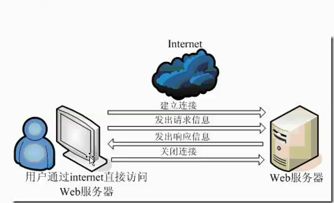

```{r golbal-optional,message=FALSE,echo=FALSE,warning=FALSE,eval=F}
library(knitr)
opts_knit$set(cache=T,eval=F,highlight=TRUE)
```

# http协议


## 1.什么是http
>超文本传输协议（英文：HyperText Transfer Protocol，缩写：HTTP）是互联网上应用最为广泛的一种网络协议。设计HTTP最初的目的是为了提供一种发布和接收HTML页面的方法。通过HTTP或者HTTPS协议请求的资源由统一资源标识符（Uniform Resource Identifiers，URI）来标识。
>HTTP是一个客户端终端（用户）和服务器端（网站）请求和应答的标准（TCP）。



如上图所示http协议是联通服务器与客户端之间的一个协议，在连接的过程，客户端首先与服务器`建立连接`，接着`发出请`求，服务器根据接受的请求作出相应的`响应信息`，最终关闭连接。  
### 1.http1.0 和http1.1 版本之间的差异

>超文本传输协议已经演化出了很多版本，它们中的大部分都是向下兼容的。在 RFC 2145 中描述了HTTP版本号的用法。客户端在请求的开始告诉服务器它采用的协议版本号，而后者则在响应中采用相同或者更早的协议版本。

### 2. 0.9协议
>已过时。只接受GET一种请求方法，没有在通讯中指定版本号，且不支持请求头。由于该版本不支持POST方法，因此客户端无法向服务器传递太多信息。  

### 3. HTTP/1.0 协议 
>这是第一个在通讯中指定版本号的HTTP协议版本，至今仍被广泛采用，特别是在代理服务器中。  

### 4. HTTP/1.1 协议 
>持久连接被默认采用，并能很好地配合代理服务器工作。还支持以渠道方式在同时发送多个请求，以便降低线路负载，提高传输速度。
HTTP/1.1相较于HTTP/1.0协议的区别主要体现在： 

- 缓存处理
- 带宽优化及网络连接的使用
- 错误通知的管理
- 消息在网络中的发送
- 互联网地址的维护
- 安全性及完整性  

## 2.url基本格式

基本格式 scheme://host{:port#]/path/.../[?query-string][#anchor]

- scheme: 指定底层使用的协议（例如：http、https、ftp）
- host http服务器的IP地址或者域名
- port# http服务器的默认端口是80 ，这种情况下端口号可以被省略
- path 访问资源的路径
- query-string  发送给http服务器的数据
- anchor-  锚

比如：http://login.sina.com.cn/signup/signin.php?entry=sso  
- http:// 协议  
- login.sian.com.cn 域名  
- signup/signin.php 路径  
- ?entry=sso 附送给http服务器的数据  
- ?之后是query ，提交给服务器的信息，等待服务器返回信息  


## 请求request

* Method/path-to -resource /HTTP Version-number  #请求行  
* header-Name-1 :value    #请求报头  
* header-name-2 :value    #请求报头  
* optional request body   # 消息正文  

- Method表示请求方法，比如"GET","POST",'HEAD',"PUT","DELETE","OPTIONS","TRACE","CONNECT"
        Method的方法是区分大小写
- path-to-resource 表示请求的资源
- HTTP Version-number 表示http协议的版本号

### 请求报头

- Host 服务器的地址
- Accept 浏览器可以接受的类型,一般是HTML,或者用通用符*来表示，表示接受所有的类型
- Accept_encoding  不是指字符编码，是浏览器声明编码方法，主要是指压缩方法
- Aceept-language  接受的语言，一般是em-us或者zh 
- User-agent  浏览器或者系统版面
- Cookie
- Referer
- Connection

## 响应response

* 状态行、消息报头、响应正文
  * http/vesion-number  status code  message 
  * Header-Name-1:value
  * Header-Name-2:value
  * Optional Response body
1. HTTP/vesion-number 表示HTTP协议的版本号
2. status-code 和 message表示状态码以及状态信息

### 消息报头
* Server 服务器信息
* Date  日期
* Last-Modified 最近一次修改时间
* Content-type 服务器告知浏览器自己的响应类型 如“text/html”
* Connection  连接情况 "Keep-alive"
* X-Powered-By  网站是用和什么技术开发的，比如python、php、Java等开发的
* Content-Length 字符串长度
* Set-Cookie    用于把cookie发送到服务器  
# RCurl三大函数

## 1.getURL()
### url.exists()  

查看网址是否存在
```{r url.exists}
library(RCurl)
url="http://www.baidu.com"
url.exists(url)
url.exists("fttp:baidu.com") #FALSE
```


### debugGatherer()
```{r debugGatherer}
url="http://www.baidu.com"
d=debugGatherer()
d 
temp=getURL(url,debugfunction=d$update,verbose=T) #verbose=T 叠加信息
d  
d$value()
cat(d$value()[1]) #服务器地址以及端口号

cat(d$value()[3]) #提交服务器返回的头信息
cat(d$value()[2]) #服务器返回的头信息

```

- 再次运行下上一句函数，返回的信息会叠加
```{r}
temp=getURL(url,debugfunction=d$update,verbose=T) #verbose=T 叠加信息
cat(d$value()[1]) #叠加了一次
```

- 如果verbose=F的话不会叠加
```{r}
temp=getURL(url,debugfunction=d$update,verbose=F) 
cat(d$value()[1]) #还是两次
```

- d$reset 重置d里的值
```{r}
d$reset()
cat(d$value()[1]) #重置了，空值
temp=getURL(url,debugfunction=d$update,verbose=T) #verbose=T 叠加信息
cat(d$value()[1]) #又记录了
```


- 查看服务器端返回的头信息
字符串形式
```{r}
url="http://www.baidu.com"
d= debugGatherer()
header=basicTextGatherer()
temp=getURL(url,headerfunction=header$update)
names(d$value())
d$value()
```

另一种方式可以以列表的方式查看返回的头信息
 
```{r}
h=basicHeaderGatherer()  #一个是basicTextGatherer，一个是basicHeaderGatherer()
txt=getURL(url,headerfunction=h$update)
names(h$value())
h$value()
```

- 伪装报头
```{r}
#设置报头
myHttpheader <- c(
"User-Agent"="Mozilla/5.0 (Windows; U; Windows NT 5.1; zh-CN; rv:1.9.1.6) ",
"Accept"="text/html,application/xhtml+xml,application/xml;q=0.9,*/*;q=0.8",
"Accept-Language"="en-us",
"Connection"="keep-alive",
"Accept-Charset"="GB2312,utf-8;q=0.7,*;q=0.7"
)
d=debugGatherer()
temp <- getURL("http://cos.name/",httpheader=myHttpheader,debugfunction=d$update,verbose=T)
cat(d$value()[1]) #服务器地址以及端口号
cat(d$value()[3]) #提交服务器返回的头信息
cat(d$value()[2]) #服务器返回的头信息

```


## 2.getForm()

--getFormParams 
```{r}
url="https://www.baidu.com/s?wd=wampserver%20&rsv_spt=1&rsv_iqid=0xc0a4ab5d000835c8&issp=1&f=8&rsv_bp=1&rsv_idx=2&ie=utf-8&tn=baiduhome_pg&rsv_enter=1&oq=Rcurl&rsv_t=964cIKjChH%2B886JRxoi3IOKsYqe3ANh2R6BKNlnL3uwGAxwK8NmnFi2GrJuOMew8k1ls&inputT=4626&rsv_pq=f88d935300008f12&rsv_sug3=133&rsv_sug1=72&rsv_sug2=0&rsv_sug4=4626"
getFormParams(url)
```


## 3.postForm()